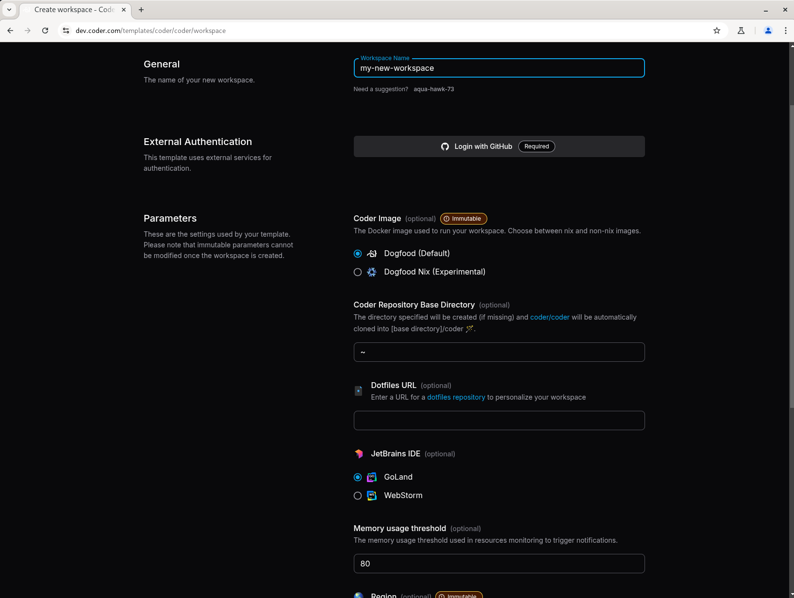

<!-- markdownlint-disable MD041 -->

  
  

<h1>
  Workspace Parameters sourced from Terraform
</h1>

 
 

[Quickstart](#quickstart) | [Docs](https://coder.com/docs) |
[Why Coder](https://coder.com/why) |
[Premium](https://coder.com/pricing#compare-plans)

This repository contains a component of Coder that handles workspace parameter
management via Terraform. It's responsible for extracting and managing
[workspace parameters](https://coder.com/docs/admin/templates/extending-templates/parameters)
from Terraform configurations, supporting [Coder's](https://coder.com) core
functionality of creating cloud development environments (like EC2 VMs,
Kubernetes Pods, and Docker containers).

The primary repository for Coder is [here](https://github.com/coder/coder).

<!--Should update this with the new cool form options -->

  

<!-- TODO: Add a usage section that links to coder/coder doc for how to use the `preview` command in coder cli -->

## Support

Do you have a workspace template that has incorrect parameters? Please open
[workspace template behavior issue](https://github.com/coder/preview/issues/new?template=workspace-template-bug-report.md).

For other bugs, feature requests, etc, feel free to
[open an issue](https://github.com/coder/preview/issues/new).

[Join our Discord](https://discord.gg/coder) to provide feedback on in-progress
features and chat with the community using Coder!
